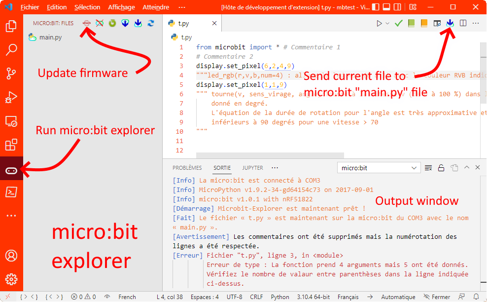

# Microbit Explorer

A Visual Studio Code extension for students who code the BBC micro:bit with Python. 

Explore micro:bit with MicroPython in Visual Studio Code.

This is principally based on:
> sos82 extension : https://github.com/sos82/vscode_micropython

And also on:
> Stapted extension : https://github.com/oivron/microbit-extension-vscode

> microsoft garage device simulator : https://github.com/microsoft/vscode-python-devicesimulator

Thanks for their work.

## Features
* Provides translated stubs (see below) for microPython and micro:bit.
* Supports both micro:bit V1 and V2.
* Quickly send py file to the micro:bit.
* If wanted, clear all comments and empty line.
* Reads error messages from the micro:bit.
* Add button to send file directly in  micro:bit main file.
* Add contextual menu in file explorer to send file to micro:bit with or without comments.
### and in the explorer view
* Explore files in micro:bit.
* Upload all files to micro:bit.
* Download files from micro:bit to local space.
* Delete file on micro:bit.
* Add "Micro:bit" output to get status of device.

## Preconditions
* Install MicroPython in micro:bit first. 
* Have open folder or workspace to use features.
* Install Python and Pylance microsoft extensions.

## How to use

* Clic on the colored micro:bit button to send your python file into main.py on micro:bit.

or
* Right clic in the file explorer to send the file without renaming it into the micro:bit with or without comments.

Error message (and other) appear directly in the output console.

* Or clic on micro:bit icon to open microbit explorer.

https://user-images.githubusercontent.com/1547522/164513525-d6d341de-2d4d-4e49-8d26-67e57ef89f80.mp4

## Translate 
1. Clone repository.
1. Run "npm install" at root.
### stubs

1. Duplicate one of the stubs-electropol-xx folder.
1. Rename this folder with locales code (https://code.visualstudio.com/docs/getstarted/locales).
1. Pull request or send me by private message.
### Interface
1. You can use "i18n ally" extension as recommended.
1. Duplicate the file with local code you understand (in src\locales).
1. Rename it with locales code (https://code.visualstudio.com/docs/getstarted/.
1. Pull request or send me by private message.
1. If you want to test, copy the file in root folder and rename like package.nls.XX.json where XX is the local code.
## Quick links

* [Micro:bit MicroPython](https://microbit-micropython.readthedocs.io/en/v2-docs) 

## Contribution
Contributions are always welcome.
