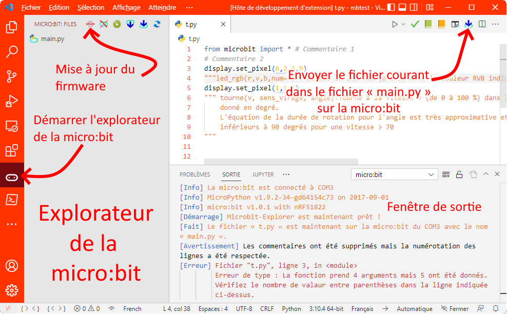

# Microbit Explorer

Une extension de Visual Studio Code pour les étudiants qui programment la BBC micro:bit avec Python. 

 Explorez la micro:bit avec Visual Studio Code. 

 Principalement basé sur :
> sos82 extension : https://github.com/sos82/vscode_micropython

Et aussi :
> Stapted extension : https://github.com/oivron/microbit-extension-vscode

> microsoft garage device simulator : https://github.com/microsoft/vscode-python-devicesimulator

Merci pour leur travail.

## Fonctionnalités
* Fournis des stubs et des erreurs traduites (voir ci-dessous) pour micropython et micro:bit.
* Prend en charge micro:bit V1 et V2.
* Envoye rapidement le fichier py à la micro:bit.
* Si nécessaire, efface tous les commentaires et les lignes vides.
* Lis et traduis les messages d’erreur de la micro:bit.
* Ajout d’un bouton pour envoyer un fichier directement dans le fichier main.py de la micro:bit.
* Ajout d’un menu contextuel dans l’explorateur de fichier pour envoyer un fichier à la micro:bit avec ou sans commentaires.
* Possibilité de mettre à jour directement le firmware de la micro:bit.
* Possibilité d'afficher le brochage de la micro:bit.
### et dans la vue de l’explorateur
* Explorez les fichiers dans la micro:bit.
* Téléchargez tous les fichiers sur la micro:bit.
* Téléchargez des fichiers de la micro:bit vers l’espace local.
* Supprimer un fichier sur la micro:bit.
* Ajout d’une fenêtre de sortie « micro:bit » pour obtenir l’état de l’appareil et un rapport d’erreur.

## Conditions préalables
* Installez Micropython sur la micro:bit d’abord (avec le bouton pour mettre à jour le firmware).
* Un dossier ou un espace de travail doit être ouvert pour utiliser les fonctionnalités.
* Installez les extensions Microsoft Python et Pylance.

## Comment l’utiliser

* Clic sur le bouton micro:bit ()en couleur) pour envoyer votre fichier python dans main.py sur la micro:bit. Ce bouton apparaît seulement pour les fichiers .py.

ou
* Clic droit sur un fichier de l’explorateur de fichiers pour envoyer le fichier sans le renommer dans la micro:bit avec ou sans commentaires.

Les messages d’erreur (et autres) apparaissent directement dans la console de sortie.

* Ou clic sur l’icône micro:bits pour ouvrir Microbit Explorer.

https://user-images.githubusercontent.com/1547522/164513525-d6d341de-2d4d-4e49-8d26-67e57ef89f80.mp4

## Traduction 
1. Cloner le Référentiel github. 
 1. Exécutez « npm install » à la racine. 
 ### Stubs et erreurs 

 1. Dupliquez l’un des dossiers Stubs-Electropol-XX. 
 1. Renommez ce dossier avec le code local (https://code.visualstudio.com/docs/getstarted/locales). 
 1. Traduire (Error est dans « Micropython\error.json ») 
 1. Exploitez la demande ou envoyez-moi par message privé. 
 ### Interface  
 1. Vous pouvez utiliser l’extension « i18n ally » comme recommandé. 
 1. Dupliquez le fichier avec le code local que vous comprenez (dans src\locales). 
 1. Renommez-le avec le code local (https://code.visualstudio.com/docs/getstarted/. 
 1. Traduisez-le. 
 1. Faites un pull request ou envoyez-moi un message privé. 
 1. Si vous souhaitez tester, copiez le fichier dans le dossier racine et renommez-le comme « package.nls.xx.json » où xx est le code local. 
 ## Liens rapides 

 * [Micro:bits micropython] (https://microbit-microphython.readthedocs.io/en/v2-docs) 

 ## Contribution 
 Les contributions sont toujours les bienvenues.
